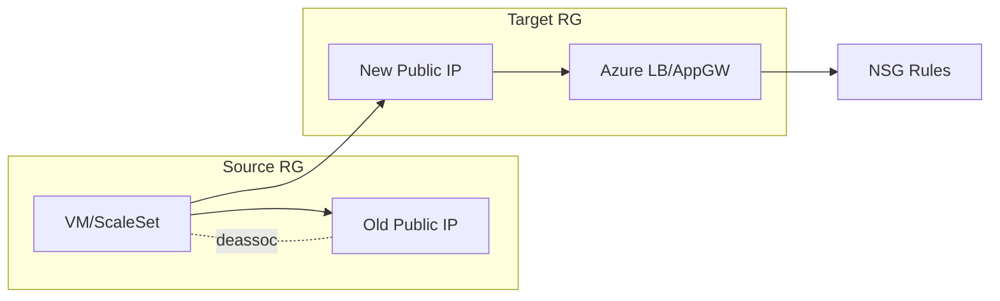

# Azure Public IP Migration — Zero-Downtime Cutover
Runbook and scripts to move workloads to new Public IPs with validation and rollback.

## Architecture


## Commands
```powershell
# Dry run
./scripts/Invoke-PublicIpMigration.ps1 -ResourceGroup rg-net-prod -OldIp "203.0.113.10" -NewIpName "pip-web-02" -WhatIf
# Execute
./scripts/Invoke-PublicIpMigration.ps1 -ResourceGroup rg-net-prod -OldIp "203.0.113.10" -NewIpName "pip-web-02"
```

## Validation
- HTTP(S) probes healthy
- DNS TTLs observed
- Packet loss < 1%

## Outcome
- Observed cutover time: **<45s** per endpoint (2025-10-16)
